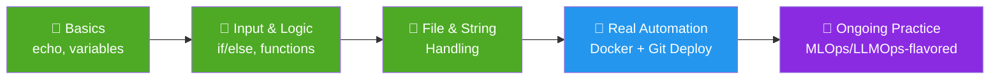

<div align="center">


<br/>


*A day-by-day, hands-on log of learning Bash for the exact automation problems AI/ML and LLM engineers hit every day — environment setup, training triggers, containerized deployment, and pipeline glue code.*

<p>
<a href="#-about-this-repo">About</a> •
<a href="#-why-shell-scripting-matters-in-mlops--llmops">Why Shell Matters</a> •
<a href="#️-day-wise-journey">Journey</a> •
<a href="#-repository-structure">Structure</a> •
<a href="#️-how-to-run">Run Locally</a> •
<a href="#-whats-next">What's Next</a> •
<a href="#-connect-with-me">Connect</a>
</p>


</div>

## 📖 About This Repo

I'm **Osama Shabih**, a B.Tech CSE (AI) student at **Jamia Hamdard University, New Delhi**, building my way toward an **AI/ML Engineering** role.

Before any ML model or LLM-powered app ever reaches a user, *something* has to set up the environment, pull the code, run the job, build the container, and push it live — reliably, every single time. That "something" is almost always a shell script. This repo is my hands-on record of learning exactly that skill, one day at a time.

> ✅ **Series completed.** Every script here (`day01` → `day07` and beyond) was written, broken, debugged, and understood by me — no copy-pasted tutorials. I'm now practicing in between other projects, adding new scripts whenever a real automation problem comes up, so expect the occasional new folder.

<div align="center">

| 📅 Days Logged | 📝 Scripts Written | 🚀 Milestone | 🧠 Status |
|:---:|:---:|:---:|:---:|
| 8 | 20+ | Docker + Git deploy pipeline | Completed, practicing further |

</div>

<br>

## 🤖 Why Shell Scripting Matters in MLOps & LLMOps

Models — classic ML or LLMs — don't ship themselves. Behind every real deployment, shell scripts quietly handle the plumbing:

| Task | Classic MLOps | LLMOps (extra relevance) |
|---|---|---|
| 🔧 **Environment Setup** | Automate Conda/venv creation, dependency installs, GPU driver checks | Bootstrap CUDA/vLLM/Ollama environments, verify GPU memory before loading large weights |
| 📦 **Data & Model Handling** | Automate ingestion, cleaning triggers, dataset versioning | Pull/quantize model checkpoints, sync prompt/eval datasets |
| 🏋️ **Training / Serving Jobs** | Kick off training, pass hyperparameters, schedule via `cron` | Launch an LLM inference server, warm up caches, run batch eval jobs |
| 🐳 **Containerization** | Build & run Docker images for reproducible environments | Package a fine-tuned model or RAG service into a deployable image |
| 🚀 **CI/CD Deployment** | `git pull` → build → test → deploy, fully automated | Roll out a new model/prompt version behind an API with zero-downtime restarts |
| 📊 **Monitoring & Logging** | Parse logs, check model/service health, send alerts | Tail token-usage or latency logs, flag hallucination/error spikes |
| ♻️ **Reproducibility** | Turn multi-step manual processes into one reliable command | Make "spin up an LLM endpoint locally" a single `./run.sh` |

> Shell scripting is the **duct tape of both MLOps and LLMOps** — invisible when it works, and the first thing you reach for when a pipeline needs to "just run."

<br>

## 🗺️ Day-Wise Journey

| Day | Topic Covered | Key Concepts |
|:---:|---|---|
| `day01` | 🌱 First Script | `echo`, shebang (`#!/bin/bash`), running a `.sh` file |
| `day02` | 🧪 Practice & Output | Writing, saving, and executing simple scripts |
| `day03` | 📂 Bash Exploration | Core Bash fundamentals, syntax practice |
| `day04` | 🔢 User Input & Conditionals | `read`, `if-else`, even/odd checker, interactive greeting scripts |
| `day05` | 🔀 Control Flow & Functions | `if`, string/number comparisons, custom functions, file-existence checks, string manipulation |
| `day06` | 📌 Variables Deep Dive | Variable naming rules, valid identifiers, quoting/assignment gotchas |
| `day07` | 🚀 **Real Deployment Automation** | `git pull` → `docker build` → `docker stop/rm/run` — a full app deploy script, the same pattern used to ship an ML/LLM service |
| `day10` | 🧩 Next-Phase Practice | Ongoing practice folder for newer automation experiments as I keep building |

<div align="center">



</div>

`day07/deploy.sh` is the milestone script — it mirrors an actual **CI/CD deployment step** you'd find automating an ML model API (or an LLM microservice) into production: pull latest code, rebuild the container, replace the running instance.

<br>

## 📁 Repository Structure

<details open>
<summary><b>Click to expand / collapse the folder tree</b></summary>

```
Shell-Scripting-for-MLops/
│
├── day01/              # First script — absolute basics
│   └── hello.sh
├── day02/              # Practice scripts
├── day03/              # Bash fundamentals continued
├── day04/              # User input + conditionals
│   ├── first.sh         # Even/odd checker
│   ├── myscript.sh       # Interactive greeting
│   └── myscript1.sh
├── day05/              # Control flow, functions, file handling
│   ├── laden.sh          # File existence check + create
│   ├── rah.sh             # Custom bash functions
│   ├── str.sh             # String manipulation
│   └── ...
├── day06/              # Variables & naming conventions
│   ├── file.sh
│   └── helllo1.sh
├── day07/              # 🚀 Deployment automation
│   └── deploy.sh          # git pull → docker build → docker deploy
├── day10/              # Ongoing / newer practice
├── hello.sh
├── LICENSE
└── README.md
```

</details>

<br>

## ▶️ How to Run

```bash
# Clone the repository
git clone https://github.com/osamashabih6960/Shell-Scripting-for-MLops.git
cd Shell-Scripting-for-MLops

# Make any script executable
chmod +x day07/deploy.sh

# Run it
./day07/deploy.sh
```

Most scripts under `day01`–`day06` are self-contained — just `chmod +x <script>.sh && ./<script>.sh` and follow the prompts.

<br>

## 🛠️ Tech & Tools

<div align="center">


</div>

<br>

## 🚧 What's Next

The structured "day-wise" series is done, but the practice continues in between other projects:

- [ ] Conda/venv bootstrap script for a fresh ML or LLM project
- [ ] A script to spin up a local LLM inference server (e.g. Ollama/vLLM) and health-check it
- [ ] Cron-based scheduled retraining / batch-eval script
- [ ] Log monitoring & alerting script for a deployed model or LLM API
- [ ] A full GitHub Actions + shell script CI/CD pipeline for a model/LLM service

<br>

## 🤝 Connect With Me

I'm **Osama Shabih**, B.Tech CSE (AI) student, actively building projects and applying for **AI/ML Engineering internships**. This repo is one piece of my public, build-in-progress portfolio.

<div align="center">

[](https://github.com/osamashabih6960)

⭐ **If this repo helped you understand shell scripting for MLOps/LLMOps, consider giving it a star!**


*"Automate everything you'd hate to do twice."* 🐚

</div>
